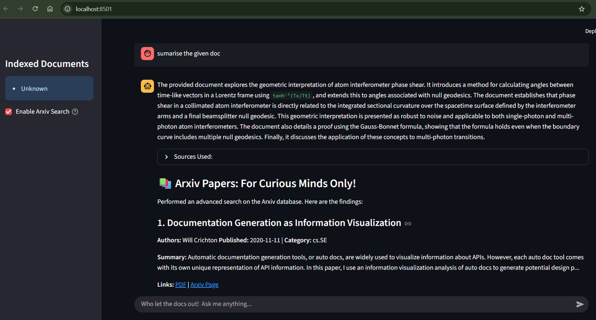
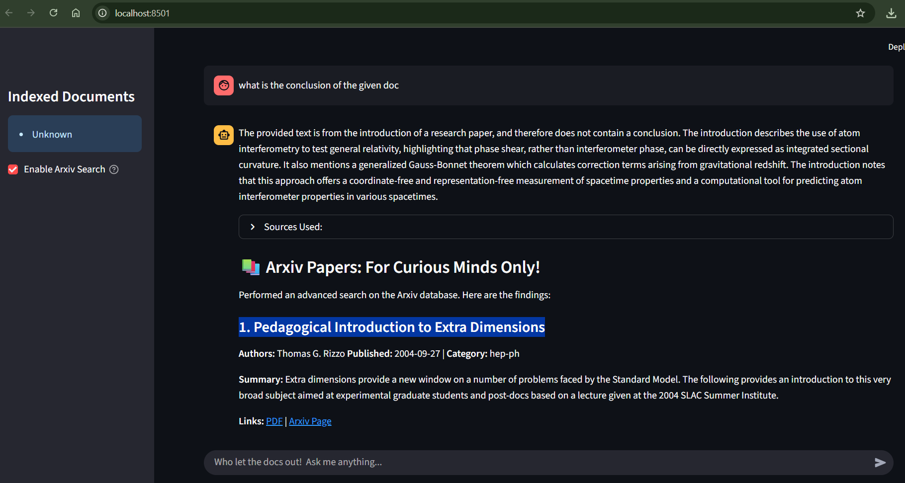
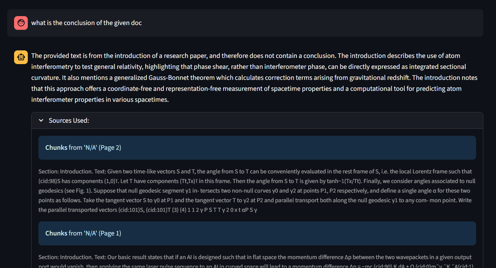

# Introducing: Document Q&A AI Agent 📄

### An enterprise-ready AI agent prototype that ingests PDF documents, extracts their content, answers user queries using LLM APIs (Google Gemini), and searches the ArXiv database for relevant research papers.

## 🚀 Features

📂 Multi-PDF ingestion pipeline (titles, abstracts, sections, tables, equations, figures/pics).

🤖 Ask questions over extracted content.

📝 Summarization & evaluation metric extraction.

⚡ Enterprise-ready optimizations.

🔌 References from Arxiv Database (Extensible to API calls).

## ⚙️ Setup & Running Instructions

### 1️⃣ Download Miniconda3 (Highly Recommended) or Anaconda
Go to 👉 https://www.anaconda.com/download (signup with email and free download).

### 2️⃣ Clone Repo
    git clone https://github.com/dannydanny123/document-qa-agent.git
    cd document-qa-agent

### 3️⃣ Create Conda Environment
(Miniconda is recommended, download if not available)

    conda env create -f environment.yml

    conda activate docqa

### 4️⃣ Install Dependencies

    pip install -r requirements.txt

## 🖥️ System-Level Dependencies

Some Python libraries require external tools to be installed before running pip install.

1. Tesseract-OCR
Required by unstructured for Optical Character Recognition.

        macOS:
        brew install tesseract

        Windows:
        Download and run the installer from the Tesseract at UB-Mannheim page.

2. unstructured IO 

        pip install "unstructured[pdf]" langchain

Also need to install layoutparser and pytesseract for unstructured.

3. Poppler
Required by unstructured and camelot for PDF rendering.

        macOS:
        brew install poppler

        Windows:
        Download the binaries, extract them, and add the bin/ folder to your system's PATH.

## 🔑 Add API Keys
Create a .env file in the project root:

    GOOGLE_API_KEY=your_key_here

## ▶️ Run the Agent

Run agent.py with command-line args mentioning multiple PDF paths (separated by spaces) in the terminal of the root dir document-qa-agent:

    python agent.py "pdf_path1" "pdf_path2" "pdf_path3" "pdf_path4" "pdf_path_n"

👉 To run the code again with the same previously processed PDFs, simply run:

    python agent.py

No need to repeat Stage 1–2 for already processed PDFs, only for new ones.

## 🖥️ Operations

agent.py is the entry point to the app and automatically calls these 3 scripts:

🚀 Stage 1 → ingestion.py
Examine the given docs, extract PDF features, and store in /data.

🚀 Stage 2 → Index_builder.py
Hybrid pipeline → Build FAISS index + Build BM25 index → Save in /data/index.

🚀 Stage 3 → app.py
Streamlit app for user-friendly interface → Renders an intuitive platform for agent-user interaction.

## 🔌 Query the Agent in Streamlit Web Page

Examples:
    "What is the Summary of Paper X?"
    "Summarise the Conclusion of given Doc, also find more papers related to the given documents!"

👉 Toggle Enable Arxiv Search in the sidebar of the UI to activate Arxiv search.

## 📸 Screenshots

## 💡 TIP

- To extract PDFs, you can customize for speed or accuracy. 
In ingest.py (Line 59), it uses "fast" strategy (faster but less accurate) compared to "hi_res" strategy (extremely accurate but relatively slower).

## 🔮 Details on Developing this Project

1. Project Research → Getting familiar with building AI Agents. (2 Days)
2. Project Setup + Ingestion Pipeline → (2 Days, Crazy Mode on)
3. RAG Pipeline + Arxiv API Call + Streamlit UI → (1 Day)

# 👤 Author

Daniel Danny Kennedy
https://www.linkedin.com/in/danny-kennedy